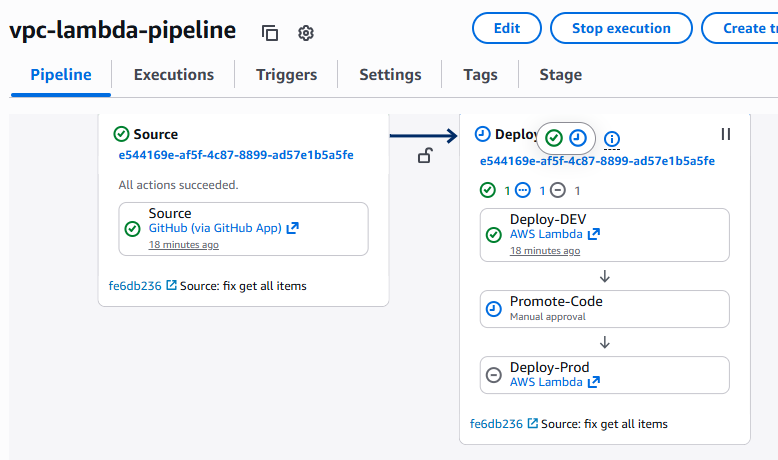
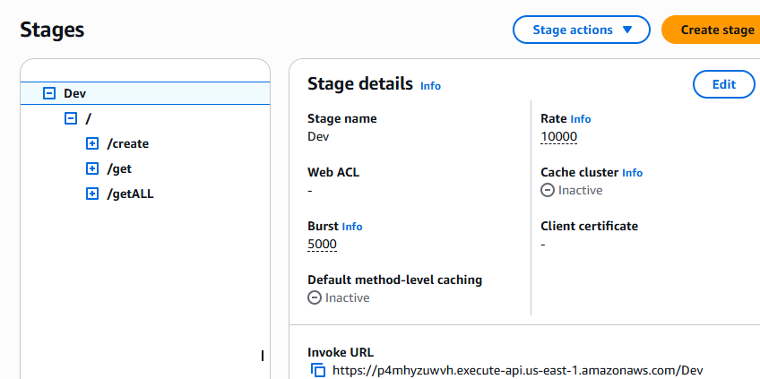

# Problem-Statement :

Create an API based on AWS services that can create a VPC with multiple subnets and store the results. We need to be able to retrieve the data of created resources from the API. The code should be written in Python. The API should be protected with an authentication layer. Authorization should be open to all authenticated users

# vpc-lambda
> AWS Lambda – VPC & Subnet Provisioning with DynamoDB Storage

>     Creates a VPC in a user-specified region
> 
>     Creates multiple subnets using user-provided CIDR blocks
> 
>     Stores VPC and subnet metadata in DynamoDB
> 
>     Retrieves stored VPC information from Dynamodb

# Services used:

    - AWS Lambda
    - AWS EC2 - VPC
    - AWS DynamoDB

# Features

 - Create VPC with custom CIDR
 - Create multiple subnets
 - Store infrastructure metadata in DynamoDB
 - Retrieve VPC information by VPC ID
 - JSON-based input structure

# IAM Role with Policy for Lambda:
 - VPC full access
 - Dynamodb Full access
 - Cloudwatch log 

# Lambda Runtime

    Python 3.14
    Boto3

# Input Parameters - POST
Resource path : /create
| Field        | Type   | Required | Description          |
| ------------ | ------ | -------- | -------------------- |
| region       | string | Yes      | AWS region           |
| vpc_cidr     | string | Yes      | CIDR block for VPC   |
| subnet_cidrs | list   | Yes      | List of subnet CIDRs |
| x-api-key    | Header | Yes      | Authenticate api     |

# Event Payload Examples
```python
    {
  "region": "us-east-1",
  "vpc_cidr": "10.0.0.0/16",
  "subnet_cidrs": [
    "10.0.1.0/24",
    "10.0.2.0/24",
    "10.0.3.0/24"
  ]
}
```
# Event Sample Response 
```json
{
    "message": "VPC and subnets created successfully",
    "VpcId": "vpc-05fb13d3100fd7cba",
    "Subnets": [
        {
            "SubnetId": "subnet-080ab5af87f359e9d",
            "CidrBlock": "10.0.8.0/27"
        },
        {
            "SubnetId": "subnet-0404fef05624bae12",
            "CidrBlock": "10.0.9.0/27"
        }
    ]
}
```
# Input Parameters - GET
Resource path : /getALL

# Event Sample Response
```json
[
    {
        "Subnets": [
            {
                "CidrBlock": "10.0.1.0/27",
                "SubnetId": "subnet-0a6d118253b276fda"
            },
            {
                "CidrBlock": "10.0.2.0/27",
                "SubnetId": "subnet-0eac16bfef326aacb"
            }
        ],
        "Region": "us-east-1",
        "VpcId": "vpc-0eb587622219c7cac",
        "VpcCidr": "10.0.0.0/16",
        "CreatedAt": "2026-02-19 06:48:05.972997"
    },
    {
        "Subnets": [
            {
                "CidrBlock": "10.0.4.0/27",
                "SubnetId": "subnet-090573c2f4c85f215"
            },
            {
                "CidrBlock": "10.0.5.0/27",
                "SubnetId": "subnet-0b419bfa2362ac2d3"
            }
        ],
        "Region": "us-east-1",
        "VpcId": "vpc-0219bb276e07694fc",
        "VpcCidr": "10.0.0.0/16",
        "CreatedAt": "2026-02-19 07:24:30.241282"
    }
]
```

# Input Parameters - GET
Resource path : /get
| Field        | Type   | Required | Description          |
| ------------ | ------ | -------- | -------------------- |
| region       | string | Yes      | AWS region           |
| vpc_id       | string | Yes      | CIDR block for VPC   |
| x-api-key    | Header | Yes      | Authenticate api     |
# Event Payload Examples
```python
    {
  "region": "us-east-1",
  "vpc_id": "vpc-******"
}
```
# Event Sample Response 
```json
{
    "Subnets": [
        {
            "CidrBlock": "10.0.1.0/27",
            "SubnetId": "subnet-0a6d118253b276fda"
        },
        {
            "CidrBlock": "10.0.2.0/27",
            "SubnetId": "subnet-0eac16bfef326aacb"
        }
    ],
    "Region": "us-east-1",
    "VpcId": "vpc-0eb587622219c7cac",
    "VpcCidr": "10.0.0.0/16",
    "CreatedAt": "2026-02-19 06:48:05.972997"
}
```
# Deployment Steps :
Codepipeline - 
Auto trigger when there is code changes in repository main branch. It helps for frequent release of services.

    https://us-east-1.console.aws.amazon.com/codesuite/codepipeline/pipelines/vpc-lambda-pipeline/view?region=us-east-1
    ]

# Integration Testing :
AWS Apigateway - 
    https://p4mhyzuwvh.execute-api.us-east-1.amazonaws.com/Dev
    


